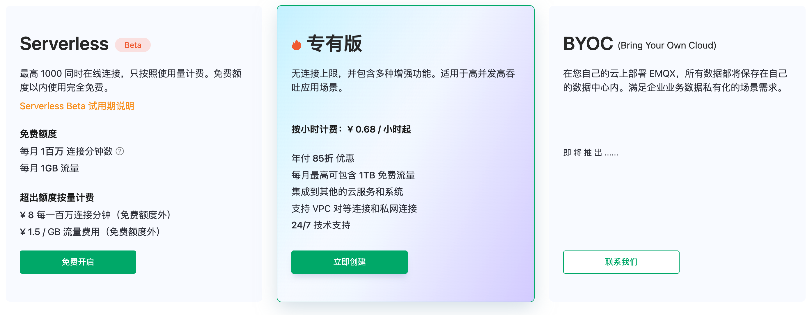

# 创建专有版部署

在本教程中，您将学习如何创建新的 EMQX Cloud 专有版部署。

## 创建部署

1. 登录账户，进入 EMQX Cloud [控制台](https://cloud.emqx.com/console/)。
2. 点击**新建部署**按钮进入新建部署页面。
3. 依据您的需求选择相应的版本，这里选择专业版。

   

4. 依据您的需求选择相应规格配置。

   

   - 选择云平台：EMQX Cloud 暂时支持华为云、阿里云、腾讯云和 AWS 中国，如您有其他云服务提供商需求，您可以提交 [工单](../feature/tickets.md) 或通过邮件（cloud-support@emqx.io）和我们联系。
   - 选择区域：EMQX Cloud 暂时支持华为云（广州，上海，北京），阿里云（深圳，上海，杭州，北京，张家口），腾讯云（广州，上海，北京），AWS 中国（北京，宁夏）如您有其他区域需求，您可以提交 [工单](../feature/tickets.md) 或通过邮件（cloud-support@emqx.io）和我们联系。
   - 选择最大连接数：客户端最大允许接入数，您后续可以通过升降部署规格实现增加和减少最大连接数。
   - 消息上下行 TPS：部署每秒钟发送和接收消息条数的总和，您后续可以通过升降部署规格实现增加和减少消息上下行 TPS。

5. 在 **确认** 页核对部署信息。

   

6. 点击 **立即部署** 并同意 EMQX Cloud 标准服务条款。您将跳转到控制台部署详情页面。
7. 等待 5 分钟左右直至部署运行状态为**运行中**。
8. 您可以前往 [连接到部署](../connect_to_deployments/overview.md) 查看更多方法连接部署。

## 部署概览
部署概览页面可获取到连接地址和连接端口（以下 xxxxx 表示随机端口，具体端口信息以部署概览页面信息为准）：

* 实例状态：运行状态和运行时长
* 连接数：当前连接数和最大连接数
* 消息上下行 TPS：当前每秒钟消息发送和接收条数和上限
* 部署名称：该部署的名称，可以通过点击右侧的编辑按钮进行修改

* 连接地址

  * 专业版部署连接地址：IP

  * 基础版连接地址：以 emqx.cloud 后缀结尾的域名

* 连接端口：

  * 专业版部署端口：默认开启 1883(mqtt)、8083(ws)，您可以通过配置 TLS/SSL 开启 8883(mqtts) 和 8084(wss) 端口。
  * 基础版部署端口：**15xxx**(mqtt)， **8083**(ws)， **15xxx**(mqtts)， **8084**(wss)

### [TLS/SSL 配置](./tls_ssl.md)

EMQX Cloud 提供自定义 **单双向 TLS/SSL** 认证，并支持 **自签名证书** 和 **CA 签名证书**。

### [VPC 对等连接配置](./vpc_peering.md)

EMQX Cloud 支持同云服务商、同区域与客户已有 VPC(Virtual Private Cloud) 创建对等连接。 VPC 对等连接是两个 VPC 之间的网络连接，通过此连接，使两个 VPC 中的实例可以彼此通信，就像它们在同一网络中一样。

### [私网连接 PrivateLink 配置](./privatelink.md)
私网连接（PrivateLink）能够实现 EMQX Cloud 部署所在的专有网络 VPC 与公有云上的服务建立安全稳定的私有连接，简化网络架构，实现私网访问服务，避免通过公网访问服务带来的潜在安全风险。

### [API 访问](../api/introduction.md)

EMQX Cloud 提供了 REST API 以实现与外部系统的集成，例如查询客户端信息、发布消息和创建规则等。
